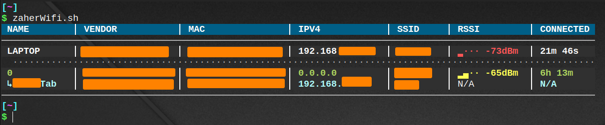

# zaherWifi

A single Bash script that scans your local Wi-Fi network and prints a clean, color-coded table of every connected device: name, vendor, MAC, IP, SSID, signal strength, and connection time.



## What it does

* Detects the active Wi-Fi interface, SSID, your IP/MAC, and the gateway.
* Sweeps the whole `/24` subnet with ping, then runs `arp-scan` and merges the results with the neighbor table.
* Optionally logs in to your router's admin panel to pull live data: signal strength (RSSI), connection duration, real SSID, and DHCP hostnames.
* Looks up the vendor of each MAC address and caches the results locally.
* Detects randomized (private) MAC addresses and merges duplicate entries of the same device.
* Drops stale router entries with a ping liveness check, so disconnected devices are not shown as online.
* Lets you assign your own names to devices by MAC address.
* Pins your own device on top and groups devices by how they connect (direct, bridge, behind bridge).
* Falls back to ARP-scan data only when the router is unavailable.

## Output columns

| Column | Meaning |
|--------|---------|
| NAME | Custom name, then router/DHCP hostname, then vendor name, then `(unknown)` |
| VENDOR | Manufacturer from the MAC address (`-- Randomized --` for private MACs) |
| MAC | Device MAC address |
| IPV4 | Device IP address |
| SSID | Wi-Fi network the device is connected to |
| RSSI | Signal strength as colored bars (needs router data) |
| CONNECTED | How long the device has been connected (needs router data) |

## Requirements

* Linux
* `bash`, `ip`, `ping` (`iproute2`, `iputils-ping`)
* `arp-scan`
* `python3`
* `sudo`
* `iwgetid` (`wireless-tools`) to show the SSID
* `curl` and `sha256sum` for the router login (optional)

## Installation

Run:

```bash
git clone https://github.com/USERNAME/zaherWifi.git && \
cd zaherWifi && \
sudo install -m 755 zaherWifi.sh /usr/local/bin/zaherWifi
```

## Configuration

Edit these values at the top of `zaherWifi.sh`:

| Variable | Purpose | Default |
|----------|---------|---------|
| `ROUTER_IP` | Router address. Router data is used only when your gateway matches it | `192.168.111.1` |
| `USERNAME` | Router admin username | `admin` |
| `PASSWORD` | Router admin password | set it yourself |
| `CUSTOM_NAMES` | MAC → name list for your devices | example entries |

> Never commit your real router password or device list to a public repository.

The router login targets one specific router web interface. On any other router the script simply shows ARP-scan data.

## Usage

```bash
zaherWifi                       # full scan
zaherWifi SKIP_ROUTER_API=1     # ARP-scan only, no router login
zaherWifi NO_VENDOR_LOOKUP=1    # no internet vendor lookup
zaherWifi ROUTER_IP=192.168.1.1 # different router address
```

Options are passed as `VAR=value`. Anything else is rejected.

| Option | Description | Default |
|--------|-------------|---------|
| `ROUTER_IP` | Router address | `192.168.111.1` |
| `SKIP_ROUTER_API` | `1` to skip the router login | `0` |
| `NO_VENDOR_LOOKUP` | `1` to skip online vendor lookup (uses cache only) | `0` |
| `LIVENESS_CHECK` | `0` to disable the stale-entry ping check | `1` |
| `PING_TIMEOUT` | Seconds to wait for the liveness ping | `1` |
| `TIMEOUT` | Router request timeout in seconds | `10` |
| `VENDOR_CACHE_FILE` | Vendor cache path | `~/.cache/zaherWifi_oui_cache.tsv` |
| `NAMES_FILE` | Custom names file path | `~/.cache/zaherWifi_names.tsv` |
| `DEBUG` | `1` to save a curl trace for the router requests | `0` |
| `NO_COLOR` | Set to any value to disable colors | unset |

## Custom device names

Two sources, checked in this order (the first wins):

1. The `CUSTOM_NAMES` list inside the script.
2. The names file (`~/.cache/zaherWifi_names.tsv`), one device per line, **tab-separated**:

```
AA:BB:CC:DD:EE:FF	Living-Room-TV
11:22:33:44:55:66	My-Phone
```

Lines starting with `#` are ignored.

## Notes

* The script re-runs itself with `sudo`, because `arp-scan` needs root.
* A full sweep takes a short while since it pings all 254 addresses.
* Vendor lookup sends MAC prefixes to `api.macvendors.com`. Use `NO_VENDOR_LOOKUP=1` to stay offline.
* Signal strength and connection time are only available when the router login succeeds.
* Use only on networks you own or are authorized to scan.
